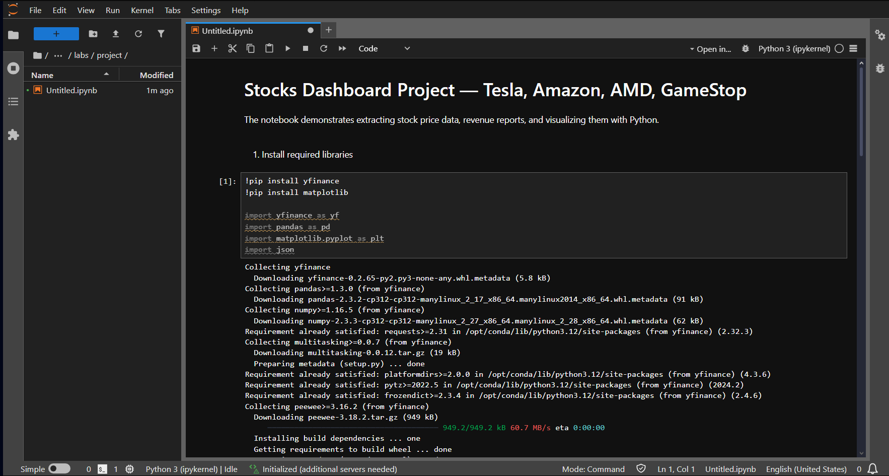
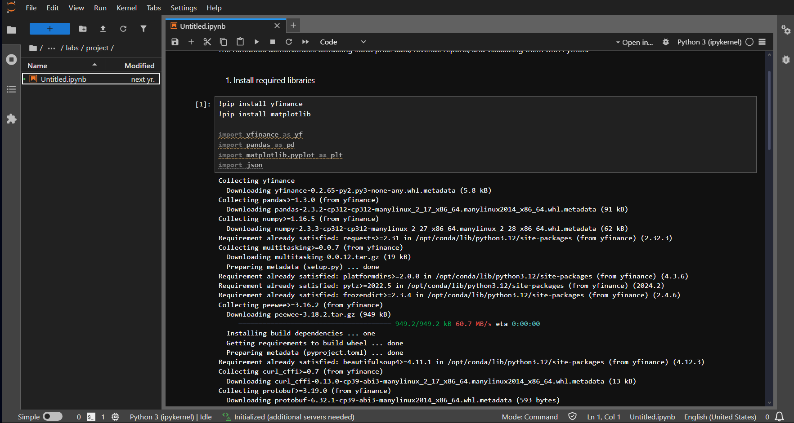
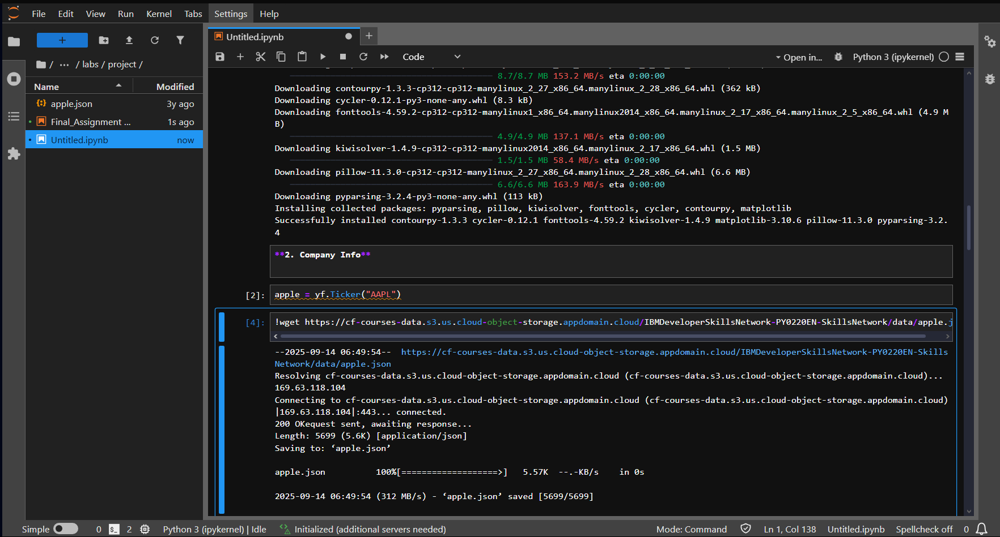
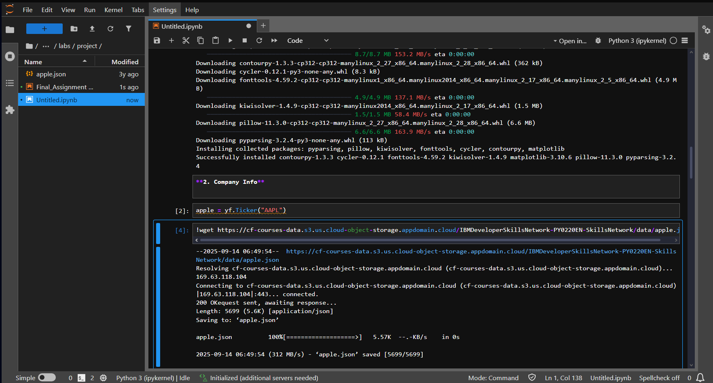
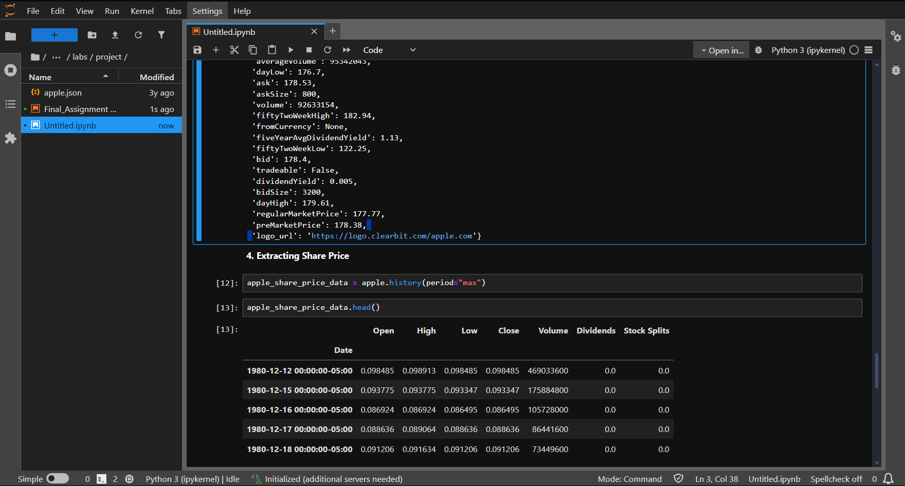
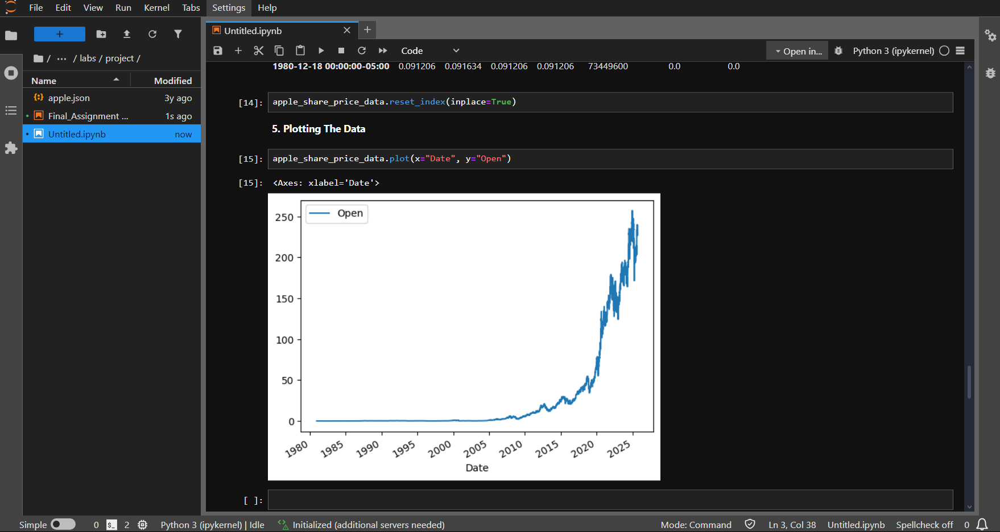
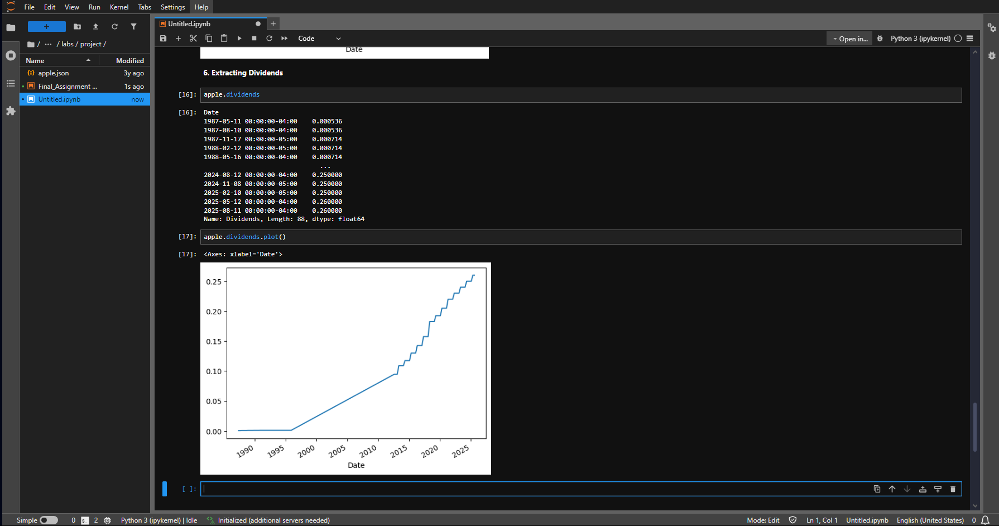
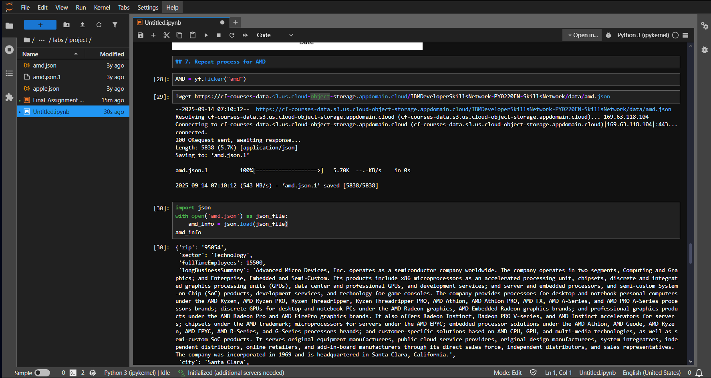
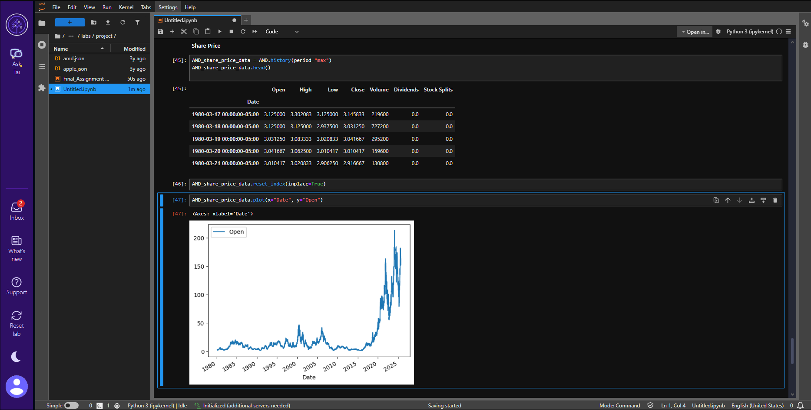
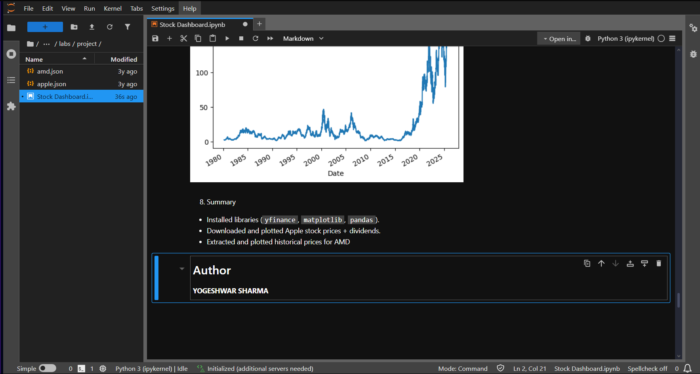

# Stock Dashboard  

This repository contains a Jupyter Notebook project that extracts, analyzes, and visualizes stock data for **Apple** and **AMD** using the `yfinance` library.  
It demonstrates how to fetch company information, stock price history, and dividends, along with plotting the data using `matplotlib`.  

## Files in this Repository  

- `Stock Dashboard.ipynb` — Jupyter Notebook with all steps of the project.  
- `Screenshots/` — Folder containing step-by-step screenshots of the notebook.  

##  Screenshots  

1. Notebook first page  
     

2. Importing required libraries  
     

3. Getting Apple information from yfinance  
     

4. Extracted metadata for Apple  
     

5. Extracting Apple stock price data  
     

6. Plotting Apple stock price data  
     

7. Extracting and plotting Apple dividends  
     

8. Extracting AMD stock price data  
     

9. Plotting AMD stock price data  
     

10. Final summary of results  
   

##  How to view
1. Open the notebook directly in GitHub.
2. Download and open in **Jupyter Notebook**.

##  Author
**Yogeshwar Sharma**
